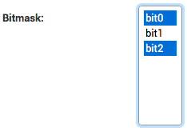

====================
django-bitmask-field
====================

BitmaskField implementation for `Django`_ ORM

.. image:: https://travis-ci.org/renskiy/django-bitmask-field.svg?branch=master
    :target: https://travis-ci.org/renskiy/django-bitmask-field

.. image:: https://coveralls.io/repos/github/renskiy/django-bitmask-field/badge.svg?branch=master
    :target: https://coveralls.io/github/renskiy/django-bitmask-field?branch=master

.. _Django: https://www.djangoproject.com

Requirements
------------

* Python 2.7 or Python 3.4+
* Django 1.8+

Example
-------

.. code-block:: python

    from django.db import models
    from django_bitmask_field import BitmaskField

    class MyModel(models.Model):

        bitmask = BitmaskField(
            choices=[(1, 'bit0'), (2, 'bit1'), (4, 'bit2')],  # available choices
            default=1 | 4,  # bit0 and bit2 are enabled by default
        )

Admin site:

Install
-------

.. code-block:: bash

    pip install django-bitmask-field
